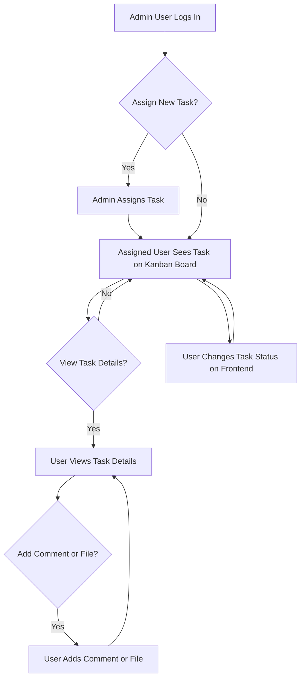
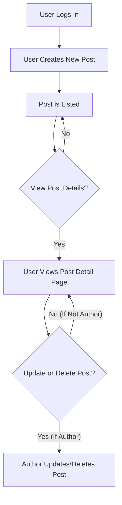
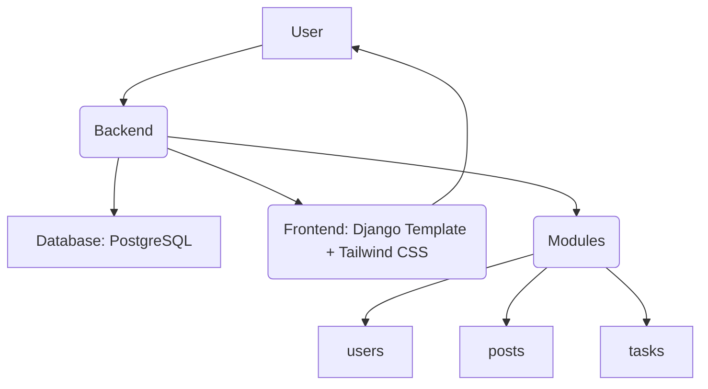

# Project Coding Plan: Kanban + Post Management Platform

This plan outlines the development steps, prioritizing backend implementation before moving to the frontend.

**Phase 1: Backend Development**

This phase focuses on building the core backend logic, database models, APIs (or views for Django Templates),

**Module 1: `users` (Authentication & Authorization)**

*   **Task 1.1: Implement Custom User Model**
    *   Create a custom user model inheriting from Django's `AbstractUser`.
    *   Add fields: `is_admin` (boolean).
    *   Configure settings to use the custom user model.
    *   Create initial migration.
*   **Task 1.2: Implement User Registration**
    *   Create a registration view and URL.
    *   Implement user creation logic with password hashing.
    *   Handle form validation and error handling.
*   **Task 1.3: Implement User Login and Logout**
    *   Create login and logout views and URLs.
    *   Implement authentication logic.
    *   Handle form validation and error handling.
*   **Task 1.4: Implement Role-based Access Control**
    *   Create decorators or mixins to restrict access based on `is_admin` status for relevant views.

**Module 2: `posts` (Post Management)**

*   **Task 2.1: Implement Post Model (with Image)**
    *   Create the `Post` model with fields: `title`, `content`, `author` (FK to User), `created_at`, `updated_at`.
    *   **Add an optional `image` field (e.g., `models.ImageField(upload_to='post_images/', blank=True, null=True)`).**
    *   Create initial migration.
*   **Task 2.2: Implement Post CRUD Views (Handle Image Upload)**
    *   Create views and URLs for listing, viewing, creating, updating, and deleting posts.
    *   Implement logic for each operation.
    *   **Modify create and update views to handle image file uploads.**
    *   Ensure only the author can update or delete their posts.

**Module 3: `tasks` (Kanban Task Management)**

*   **Task 3.1: Implement Task Models**
    *   Create the `Task` model with fields: `title`, `description`, `assigned_to` (FK to User), `created_by` (FK to User), `status` (enum: TODO, INPROGRESS, DONE), `created_at`.
    *   Create `TaskAttachment` model with fields: `task` (FK to Task), `file`, `uploaded_at`.
    *   Create `TaskComment` model with fields: `task` (FK to Task), `user` (FK to User), `text`, `tagged_users` (M2M to User), `created_at`.
    *   Create initial migrations.
*   **Task 3.2: Implement Task Views**
    *   Create views and URLs for the Kanban board view, task creation, adding comments, and uploading files.
    *   Implement logic for each view.
    *   Implement logic for updating task status (this might be a separate view or part of the board view).
*   **Task 3.3: Implement Access Control for Tasks**
    *   Ensure only admins can assign tasks.
    *   Ensure members can only update their own assigned tasks.

**Phase 2: Frontend Development**

This phase focuses on building the user interface using Django Templates and Tailwind CSS, integrating with the backend views.

*   **Task 4.1: Set up Tailwind CSS**
    *   Integrate Tailwind CSS into the Django project.
    *   Configure necessary plugins (`@tailwind/forms`, `@tailwind/typography`, `@tailwind/aspect-ratio`).
*   **Task 4.2: Design and Implement User Authentication Pages**
    *   Create templates for login and registration pages using Tailwind CSS.
    *   Connect templates to backend views.
*   **Task 4.3: Design and Implement Post Management Pages (Include Image Upload)**
    *   Create templates for post list, detail, create, update, and delete pages using Tailwind CSS.
    *   **Modify post create and update forms to include an image file input.**
    *   **Update the post detail template to display the image if it exists.**
    *   Connect templates to backend views.
*   **Task 4.4: Design and Implement Kanban Board**
    *   Create the Kanban board template using a 3-column grid layout (`grid grid-cols-3 gap-4`).
    *   Implement task card design (`rounded-xl bg-white shadow-md p-4`).
    *   Connect the board template to the backend task listing view.
*   **Task 4.5: Implement Task Detail View with Modals/Accordions**
    *   Create a task detail template.
    *   Implement modals or accordions for comments and attachments using Tailwind CSS.
    *   Connect the template to the backend task detail view (if a separate one is needed) and comment/upload views.
*   **Task 4.6: Implement Task Status Updates (Frontend)**
    *   Implement frontend logic (likely JavaScript) to handle task status changes and communicate with the backend view.
*   **Task 4.7: Refine Forms with Tailwind**
    *   Apply Tailwind classes (`@apply input input-bordered w-full`) to forms for consistent styling.

**User Flows**

Here are the key user flows for the platform:

**Task Management Flow**



**Post Management Flow**



**Mermaid Diagram: High-Level System Modules**



**Mermaid Diagram: Backend Module Interactions**

```mermaid
graph LR
    User -- FK --> Post
    User -- FK --> Task
    User -- FK --> TaskComment
    Task -- FK --> TaskAttachment
    Task -- FK --> TaskComment
    TaskComment -- M2M --> User
    Post -- Optional Image --> FileStorage[(File Storage)]